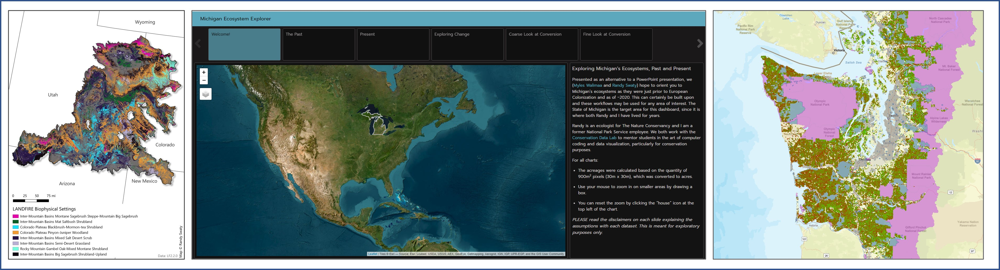

## What types of conservation problems do CDL members take on?

**Our group has:**

-   Quickly built a [dashboard](https://rswaty.github.io/carbonBlockGroups/dash.html#the-map) using R and QGIS to help start conversations about equitable investments in carbon sequestration.
-   Wrote an [online book](https://thenatureconservancy.github.io/landfire-guide/) that teaches forest managers how to use LANDFIRE data to identify High Conservation Value Areas.
-   Conducted multiple landscape-scale vegetation assessments in locations across the United States, including [this one](https://thenatureconservancy.github.io/copla/) along the Colorado Plateau.

**What do previous clients have to say about CDL?**
Collaborators of CDL collectively shared positive reflections the Conservation Data Lab’s work:

>“The CDL team were fantastic partners. They provided top-notch products in a timely and professional manner. It was great to talk through the project with them and to have their skills in geospatial data advance our project. ”– Ann Armstrong, Conservation Social Scientist, The Nature Conservancy

**What types of skills do CDL members have?**

* Data gathering, wrangling, cleaning, and visualizing in R and Excel, with increasing proficiency in Python.
* GIS analysis in R, QGIS, and ArcGIS Pro.
* Reproducible research within GitHub.
* Eagerness and a willingness to learn!

**What are enabling conditions that make amazing projects?**
CDL projects aim to provide a new perspective to real world needs that involve an active ‘client’, definable deliverables, a deadline, and (ideally) financial compensation. 

**How do I connect with the CDL?**
To be involved, please contact [Randy Swaty](mailto:rswaty@tnc.org)

 

