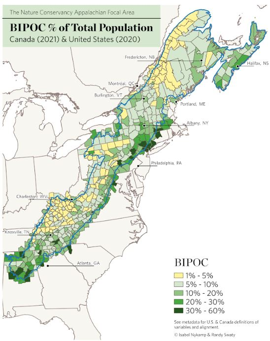
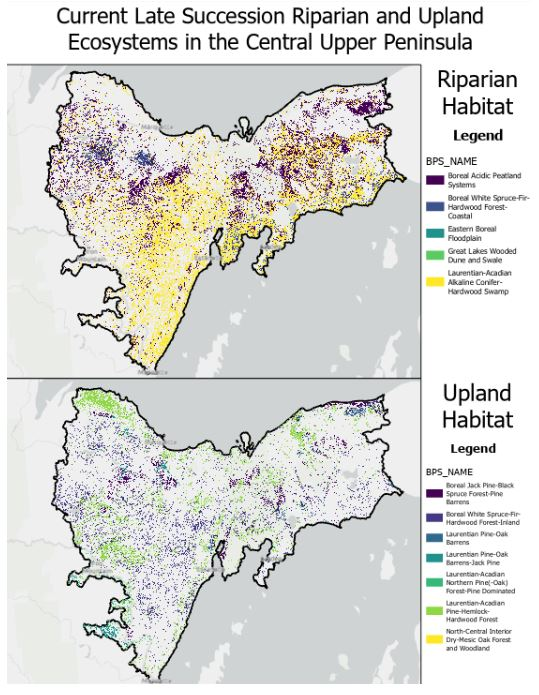

```{r setup, include=FALSE}
library(tufte)
# invalidate cache when the tufte version changes
knitr::opts_chunk$set(cache.extra = packageVersion('tufte'))
options(htmltools.dir.version = FALSE)
```

# Introduction to the Conservation Data Lab

  The [Conservation Data Lab (CDL)](https://conservationdatalab.org/) is a group of students and young professionals who are learning technical skills, practicing through conservation projects and building an amazing community.  The CDL is co-lead by Randy Swaty, ecologist with The Nature Conservancy's (TNC) LANDFIRE team, and Rachel Meier, senior associate with Lotus Engineering and Sustainability.  Randy does some CDL work as part of his position with TNC; some of the work is volunteer.  Rachel's time is purely volunteer.  Most projects are powered by [LANDFIRE](https://landfire.gov/) products and often serve TNC 'clients', though this is not always the case.


# Achievements 2023

Members of the CDL were super productive, often contributing major efforts on top of school, jobs and other life events.  We currently have 10 active members;  5 members moved to 'alumni' status.  

This year found us taking on larger challenges than in the past, with many projects 'in-progress'.  

Major projects included:


```{r fig-margin, echo=FALSE, fig.cap="Map of Black, Indigenous, People of Color for 2020/2021 by Izzy Nykamp.", fig.height=3.5, fig.margin=TRUE, fig.width=3.5, message=FALSE, warning=FALSE, cache=TRUE}


```
* [Robyn Holmes](https://www.linkedin.com/in/rnholmes/) delivered a presentation titled "Searching for Goldilocks: Exploring remotely sensed data products in the context of beaver and wildfire" at a LANDFIRE [Open Office Hour](https://www.youtube.com/watch?v=7ztYoqoooMU&ab_channel=LANDFIREvideo). Spoiler alert(s): mid-resolution data (10m pixel size) seemed to work best, and beaver dams do appear to influence wildfire behavior (supporting work by Fairfax and Whittle, 2020, and others).
* [Isabel (Izzy) Nykamp](https://conservationdatalab.org/author/isabel-nykamp/) took on a deceptively complicated project: making maps of demographic variables for the entire Appalachian Region, which reaches from Alabama into Nova Scotia.  Challenges included: 1) data differences between the US and Canada, requirement to meet The Nature Conservancy's cartographic standards in QGIS (standards developed with ArcGIS in mind), and figuring out exactly which datasets to use, when there are many.  She is a co-author on an internal report, "Equity in the Appalachians: Learning from ourselves to advance conservation
equitably at scale across the Appalachians" by Smith et al (2023).
* A continuing goal of the CDL is to train members in key conservation skills, including coding in R.  CDL mentors [Myles Walimaa](https://conservationdatalab.org/author/myles-walimaa/) and [Garrett Knowlton](https://conservationdatalab.org/author/garrett-knowlton-he/him/) joined Randy to develop a training course for R that was delivered in the fall.  This was a first for the CDL, and in the end the teachers learned as much as the students (as usual).  This process will continue to evolve as we strive to fit learning into members' super busy lives.
* [Alex Mezera](https://conservationdatalab.org/author/alex-mezera/), [Rhayna Lillie](https://conservationdatalab.org/author/rhayna-lillie/), Josh Muchner and [Garrett Knowlton](https://conservationdatalab.org/author/garrett-knowlton-he/him/) were responsible for delivery of several web reports for the Southern Rockies Fire Science Network (SRFSN), such as [this one](https://thenatureconservancy.github.io/nnmpla/) for the Northern New Mexico Plateau Subregion completed by Alex.  The work required knowledge of QGIS, GitHub, R and R-markdown files.  The web reports will be incorporated into the SRFSN website in 2024.


```{r fig-ls, echo=FALSE, fig.cap="Map of historical late-succession habitat concentration by Mary Kelly.", fig.height=3.5, fig.margin=TRUE, fig.width=3.5, message=FALSE, warning=FALSE, cache=TRUE}

knitr::include_graphics("historicOldGrowth.jpg")
```


* [Mary Kelly](https://conservationdatalab.org/author/mary-kelly/) was curious about late-succession habitat, past and present for the coastal region of Oregon.  Using [LANDFIRE](https://landfire.gov/) data, ArcGIS pro and R, she first developed and delivered a presentation at the 2023 Society for Conservation GIS meetings in August.  Additionally, she has drafted a tutorial to be published in 2024 (pending edits by Randy).


**Selected ongoing projects**

* Major progress on a project lead by [Hannah Young](https://conservationdatalab.org/author/hannah-young/) and [Mary Kelly](https://conservationdatalab.org/author/mary-kelly/) to identify areas in the United States where wildfire risk to water supplies could impact socially vulnerable people.  They are aiming for a peer-reviewed journal article.


```{r fig-cup, echo=FALSE, fig.cap="Draft map of late succession habitats for the central Upper Peninsula of Michigan by Liv Maynard and Nick Burns.", fig.height=3.5, fig.margin=TRUE, fig.width=3.5, message=FALSE, warning=FALSE, cache=TRUE}


```


* [Silas  Pickhardt](https://conservationdatalab.org/author/silas-pickhardt/), [Liv Maynard](https://www.linkedin.com/in/olivia-maynard-6bb875228/), [Nick Burns](https://www.linkedin.com/in/nicholasburns9047/) and [Trinity Hinshaw](https://www.linkedin.com/in/trinity-hinshaw-88b217225/) were recruited by the Marquette County (MI) Planning Commission to build a dashboard presenting current ecosystem, wildfire exposure risk and late-succession habitat for the central Upper Peninsula of Michigan. 

* [Eleanor Gagnon](https://www.linkedin.com/in/eleanorgagnon/) will be building a web report depicting ecological fire management needs for Missouri in support of The Nature Conservancy an other local land management partners. 

* [Emily Mydlowski](https://www.linkedin.com/in/emily-mydlowski-226680b0/) is collaborating with Melanie Rudolf of The Nature Conservancy's Arkansas chapter to update their fire management monitoring data collection forms, wrangle formerly collected data and to develop a GitHub hosted web reporting platform.

## Future directions

The CDL is vibrant and the community growing.  We have multiple new members 'in the wings' and plan to continue the focus on being supportive and completing projects.  

In 2024 we plan to:

1. Implement a 'steering committee' as a way to engage alumni and other people, set direction and monitor progress and 'health' of the CDL.
2. Add more 'friendly and supportive' accountability to help members keep on track with learning goals and career development.
3. Take on more 'short' projects to give more members a chance to showcase their skills and to contribute.


