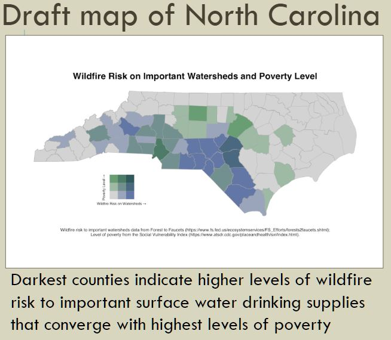
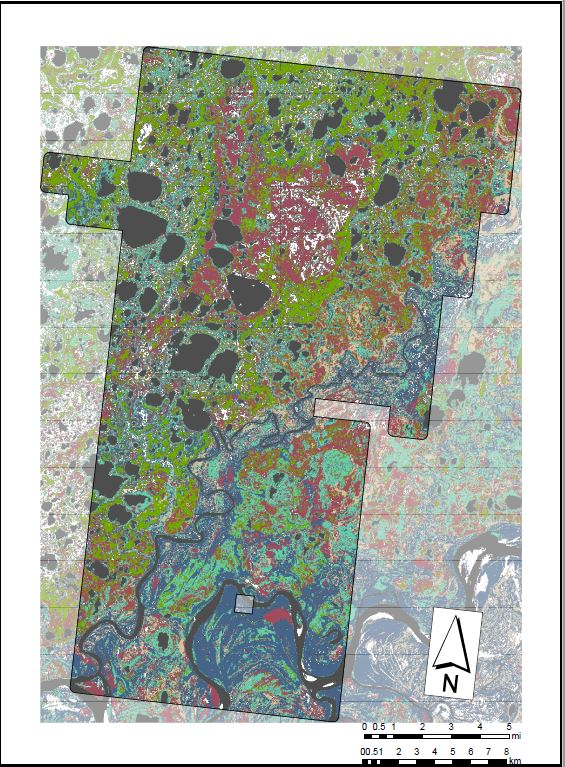
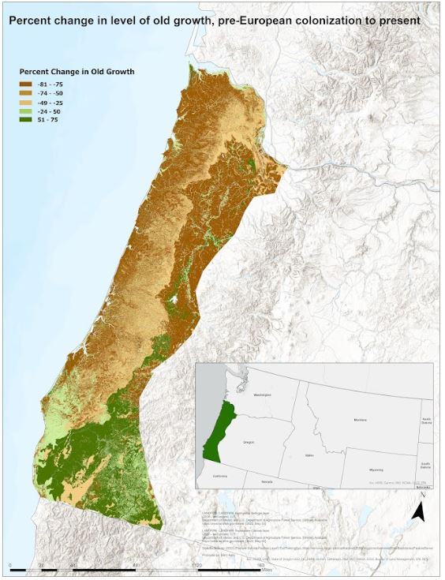

```{r setup, include=FALSE}
library(tufte)
# invalidate cache when the tufte version changes
knitr::opts_chunk$set(cache.extra = packageVersion('tufte'))
options(htmltools.dir.version = FALSE)
```

# Introduction to the Conservation Data Lab

  The [Conservation Data Lab (CDL)](https://conservationdatalab.org/) is a group of students and young professionals who are learning technical skills, practicing through conservation projects and building an amazing community.  The CDL is co-lead by Randy Swaty, ecologist with The Nature Conservancy's (TNC) LANDFIRE team, and Rachel Meier, senior associate with Lotus Engineering and Sustainability.  Randy does some CDL work as part of his position with TNC; some of the work is volunteer.  Rachel's time is purely volunteer.  Most projects are powered by [LANDFIRE](https://landfire.gov/) products and often serve TNC 'clients', though this is not always the case.


# Achievements 2022

Members of the CDL were super productive, often contributing major efforts on top of school, jobs and other life events.  We currently have 10 active members;  5 members moved to 'alumni' status.  

Major projects included:


```{r fig-margin, echo=FALSE, fig.cap="Draft bivariate map made in R by Hannah Young", fig.height=3.5, fig.margin=TRUE, fig.width=3.5, message=FALSE, warning=FALSE, cache=TRUE}


```
* Major progress on a project lead by [Hannah Young](https://conservationdatalab.org/author/hannah-young/) and [Mary Kelly](https://conservationdatalab.org/author/mary-kelly/) to identify areas in the United States where wildfire risk to water supplies could impact socially vulnerable people.  They are aiming for a peer-reviewed journal article.
* [Dashboard](https://rswaty.github.io/carbonBlockGroups/dash.html#the-map) exploring the intersection of carbon and non-white populations for Georgia and the Carolinas.  Powered by [LANDFIRE](https://landfire.gov/) and carbon data from the [Center for Resilient Conservation Science](https://crcs.tnc.org/); implemented by [Maddie Tango](https://www.linkedin.com/in/madeleinetango/) and [Steven Montilla](https://www.linkedin.com/in/steven-montilla-172437150/), used by TNC's North Carolina program.
* [Sam Kurkowski](https://conservationdatalab.org/author/sam-kurkowski/) processed and mapped LANDFIRE wetlands data for the Great Lakes to facilitate review and workshop discussions.  Sam has also reviewed dozens of documents for the LANDFIRE Review of Alaskan Biophysical Settings.
* [Keith Phelps](https://www.linkedin.com/in/keith-phelps-5aa9921a2/) and [Stacey Marion](https://staceymarion.com/) produced this [LANDFIRE-powered guide](https://thenatureconservancy.github.io/landfire-guide/) to forest assessment.  
* [Chris Eckerson](https://www.linkedin.com/in/chris-eckerson-4395b8161/) completed and delivered a comparison of TreeMap data ([Riley et al., 2021](https://www.firelab.org/project/treemap-tree-level-model-forests-united-states)) and carbon data from Williams et al., ([2021](https://daac.ornl.gov/CMS/guides/AGB_NEP_Disturbance_US_Forests.html)).  One of multiple products was [this](https://storymaps.arcgis.com/stories/72b5a732828c48d2b32148e42cc3325f) StoryMap.
```{r fig-ak, echo=FALSE, fig.cap="BpS map for the Akiachak Village AK, by Lea Kemle", fig.height=3.5, fig.margin=TRUE, fig.width=3.5, message=FALSE, warning=FALSE, cache=TRUE}


```
* [Lea Kemle](https://conservationdatalab.org/author/lea-kemle/) has developed and delivered a series of LANDFIRE-powered maps and a comparison of historical and current ecosystems to the Akiachak Village of Alaska
* [Myles Walimaa](https://mwalimaa.github.io/portfolio/) developed and delivered a [dashboard](https://mwalimaa.github.io/michigan_ecosystems/) of Michigan's ecosystems, past and present to 'clients' at Michigan State Extension.
* [Erin Matula](https://conservationdatalab.org/author/erin-matula/) completed an internship through the CDL and Northern Michigan University where she developed and presented a [dashboard](https://ematula3.github.io/VTFdash/webhost.html) of ecosystem conditions to the Vermont Chapter of The Nature Conservancy, and at the International Association for Landscape Ecology meetings,  and has processed and presented LANDFIRE data to Virgin Islands/Puerto Rico staff of TNC.
* [Rhayna Lillie](https://conservationdatalab.org/author/rhayna-lillie/) completed an internship through the CDL and Northern Michigan University where she assessed LANDFIRE data for the Uncompahgre Region of the southwestern U.S., and presented her results to Jim Smith and Henry Bastion of LANDFIRE leadership. 
* [Cassie Stitzman](https://conservationdatalab.org/author/cassie-stitzman/) with an assist from Myles Walimaa processed and delivered over 35 LANDFIRE datasets to USFWS/USFS partners in Mississippi. 


```{r fig-or, echo=FALSE, fig.cap="Map of old growth surplus/deficit, by Mary Kelly", fig.height=3.5, fig.margin=TRUE, fig.width=3.5, message=FALSE, warning=FALSE, cache=TRUE}


```

* [Mary Kelly](https://conservationdatalab.org/author/mary-kelly/) completed an internship through the CDL and Northern Michigan University where she assessed old growth ecosystems past and present for the western slope of Oregon. 
* Garrett White completed an internship through the CDL and Northern Michigan University where he assessed the vegetation conditions of the Driftless region of the central U.S.

This collection of major projects does not include all of the resume/cover letter and other smaller support projects we have completed in the last year. For example, [Braden Kelsey](https://conservationdatalab.org/project/braden/) completed a summer internship to craft several member profiles and project descriptions. 

Additionally, the CDL continually updates our website, implemented a 'bit' of structure with some members taking on a mentor role, and has developed a very supportive community.  We have weekly meetings, some of which have been graced by guests.  

## Future directions

The CDL is vibrant and the community growing.  We have multiple new members 'in the wings' and plan to continue the focus on being supportive and completing projects.  


